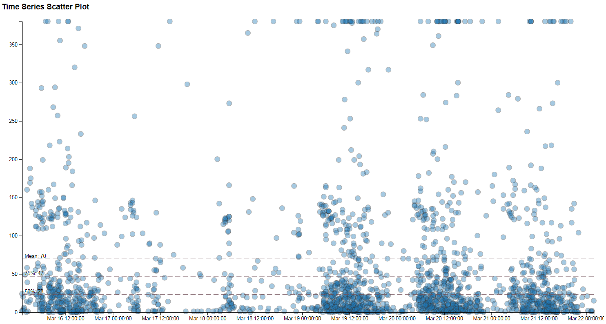
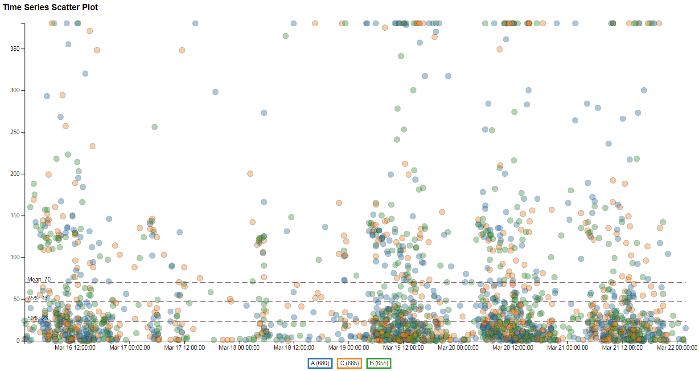

# Time Series Scatterplot
Draws a scatterplot where the X-Axis is a time series.

Example without Colors

Example with Colors

### Original Intent
I frequently deal with data involving either a timestamp or date where there is an inconsistent interval between data points and commonly multiple datapoints with the same date. Most standard visualizations did not represent this the way I wanted. So I made this.

Does a good job at showing data distribution of instances of some metric over time.
### The Files
The needed files are
* timescatter.js - The actual JS function (constructor)
* timescatter.css - The style needed to render it

The other files provide an example for how to use it

* data.csv - Dummy data, representing execution durations from a log file
* example.html - Example of how to use the function to render the chart